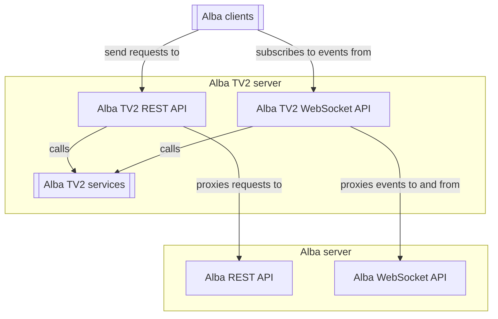

# Alba TV 2 server

Alba TV 2 server is the backend server for Alba that contains all things TV 2 specific.
This includes blueprints and specializations of the more generic types from [Alba server](https://github.com/tv2/alba-server).

## Requirements
- NodeJS >= 20.12.0
- Yarn >= 4.1.1
- A running MongoDB instance with an initialized replica set.

## Usage

### Building
The server can be built to JavaScript by:
1. Install dependencies with `yarn install`.
2. Build to the folder `/dist` with `yarn build`.
3. To start the built application, run `yarn start`.

> [!note]
> The project is intended to be run as a Docker container and is currently published to the [tv2media](https://hub.docker.com/repository/docker/tv2media/alba-server/general) space.

### Configuration
Configuration is done through environment variables:

| Variable                | Description                                                             | Example                                    |
|-------------------------|-------------------------------------------------------------------------|--------------------------------------------|
| `TV2_SERVER_API_PREFIX` | The prefix under which the REST and WEBSOCKET APIs are exposed.         | `TV2_SERVER_API_PREFIX=tv2-server`         |
| `ALBA_REST_URL`         | The URL to proxy requests to for the Alba server REST API.              | `ALBA_REST_URL=http://localhost:3005`      |
| `ALBA_WEBSOCKET_URL`    | The URL to proxy events to and from, for the Alba server WebSocket API. | `ALBA_WEBSOCKET_URL=http://localhost:3006` |
| `ALBA_TV2_SERVER_PORT`  | The port used for the REST and WebSocket APIs.                          | `ALBA_TV2_SERVER_PORT=3010`                |
| `MONGO_URL`            | The connection URL to the MongoDB instance.                      | `MONGO_URL=mongodb://localhost:3001`     |

### Running with development server
You can start a development server with `yarn watch`.
